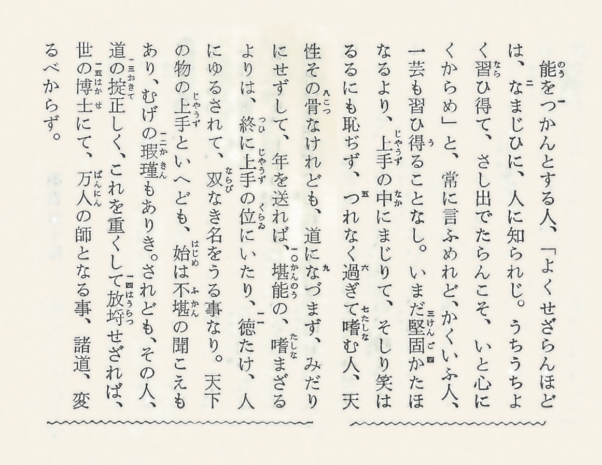

About me
===

Takayuki Muranushi (muranushi@gmail.com, nushio3@github)

RIKEN Advanced Institute for Computational Science
7-1-26, Minatojima-minami-machi, Chuo-ku, Kobe, Hyogo, 650-0047, Japan

About this Blog
===

This website is placed to publish and share [mechanical models of the
subjects I am studying](posts/2014-09-13-Kelvin.html).

The title is from passage 150 of Tsurezuregusa, one of my favorite
blog by Yoshida Kenko.

